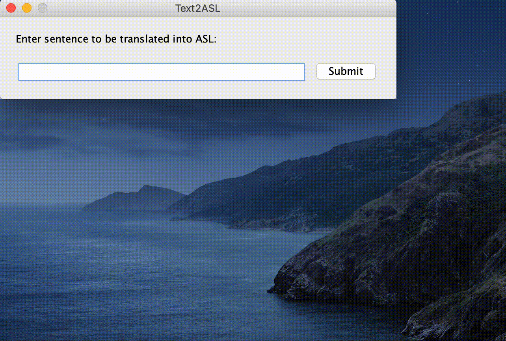

# Text2ASL
Text2ASL is an english to American Sign Language translator.

## Features
Text2ASL translates an english sentence to ASL.

To do this, Text2ASL:
- Converts the english sentence to a grammatically correct ASL sentence. (See [credits](https://github.com/thatcherclough/Text2ASL#credits))
- Uses [Signing Savvy](https://www.signingsavvy.com/) to get the video of the sign for each word in the sentence.
  - If the word has multiple meanings/signs, the user is prompted to select the correct meaning/sign.
  - If the word does not have a sign, videos for each of the letters in the word are used.
- Downloads the videos from [Signing Savvy](https://www.signingsavvy.com/) to the computer's temporary directory and plays them in order.

## Demo


## Requirements
- A Java JDK distribution >=8 must be installed and added to PATH.

## Compatibility
Text2ASL is compatible with Windows, Mac, and Linux.

## Installation
```
# clone BetterBackdoor
git clone https://github.com/thatcherclough/Text2ASL.git

# change the working directory to Text2ASL
cd Text2ASL

# build Text2ASL with Maven
# for Windows run
mvnw.cmd clean package

# for Linux or Mac run
sh mvnw clean package
```

Alternatively, you can download the jar from the [release page](https://github.com/thatcherclough/Text2ASL/releases).

## Usage
Execute 'text2asl.jar' by either double clicking it, or running
```
java -jar text2asl.jar
```

## Credits
- [Harsh Bhavsar](https://github.com/harshbhavsar) for the algorithm used to convert an english sentence to a grammatically correct ASL sentence. That repository can be found [here](https://github.com/harshbits/english-asl-algorithm).
- [Signing Savvy](https://www.signingsavvy.com/) for the sign videos.

## License
- [MIT](https://choosealicense.com/licenses/mit/)
- Copyright 2020 ©️ Thatcher Clough.
